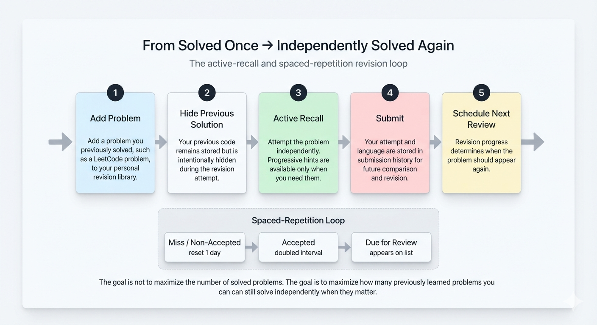
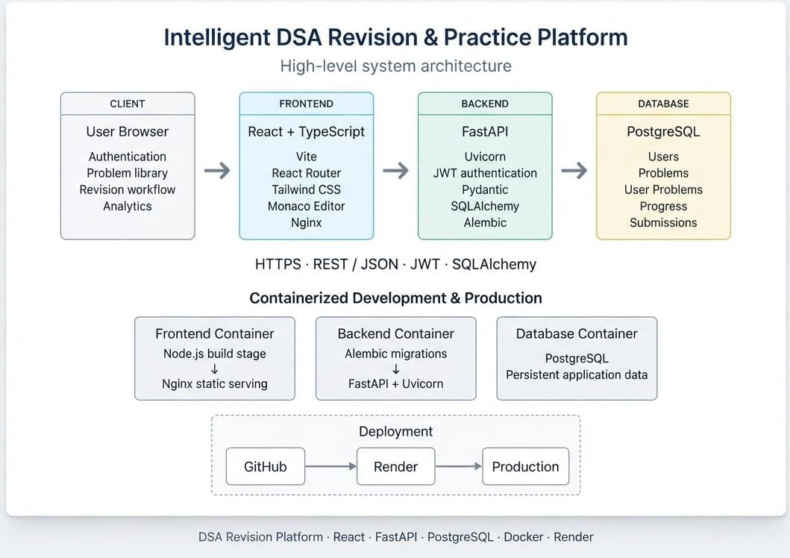

# Intelligent DSA Revision & Practice Platform

A personalized, spaced-repetition coding practice platform that answers a more honest question than *"how many problems have I solved?"* — namely, **"how many of the problems I've previously learned can I still independently solve today?"**

Built end-to-end with a React/TypeScript frontend, a FastAPI backend, and a PostgreSQL database, fully containerized with Docker and deployed to production.

🔗 **Live Demo:** [dsa-revision-frontend.onrender.com](https://dsa-revision-frontend.onrender.com/)
📦 **Repository:** [github.com/24je0657/dsa-revision-platform](https://github.com/24je0657/dsa-revision-platform)

> **Note:** the live demo runs on Render's free tier — the backend spins down after periods of inactivity, so the first request after a while may take 30–60 seconds to respond.

---

## The Problem

Students preparing for technical interviews solve dozens of DSA problems, but often can't independently reproduce their own solutions weeks later. Revisiting a "solved" problem usually means re-reading old code or an editorial — which creates a false sense of mastery. This platform replaces that passive recognition loop with **active recall**: your own past solution stays hidden, hints are revealed progressively rather than all at once, and a spaced-repetition scheduler decides when each problem is actually due for review.

---

## How it works
### Revision Workflow

<p align="center">
  
</p>

## Features

- **Personal problem library** — add problems you've solved elsewhere (e.g. LeetCode), with automatic deduplication by URL/slug so the same problem isn't duplicated across users
- **Spoiler-free revision** — your previous solution is never shown; you attempt fresh, with your own code only visible in submission history after the fact
- **Progressive hint system** — hints unlock one at a time, on request, instead of all at once
- **Real code editor** — Monaco (the engine behind VS Code), with a per-problem language selector (C++, Python, Java, JavaScript) that remembers your last-used language for each problem
- **Submission tracking** — every attempt is logged with verdict and timestamp, with live-updating history per problem
- **Spaced-repetition scheduling** — an interval-doubling algorithm (reset to 1 day on a miss, doubled on success) determines when each problem is next due, surfaced on a dedicated "Due for Review" page
- **Weak-topic analytics** — classifies each topic as *Strong*, *Weak*, or *Needs More Practice* using a coverage-and-mastery model (not just raw submission counts), fair to both large topics (Arrays, Graphs) and small ones (e.g. Biconnected Components)
- **JWT authentication** — signup/login with bcrypt-hashed passwords, protected routes on both frontend and backend

---

## Tech Stack

| Layer | Technology |
|---|---|
| Frontend | React, TypeScript, Tailwind CSS, React Router, Monaco Editor, Vite |
| Backend | FastAPI, SQLAlchemy, Alembic, Pydantic, python-jose (JWT), passlib/bcrypt |
| Database | PostgreSQL |
| Infrastructure | Docker, Docker Compose, Nginx, Render |

---


## System Architecture

<p align="center">
  
</p>


Each service — frontend, backend, database — runs as an independent Docker container. The frontend is a multi-stage build (Node.js builds the static bundle, Nginx serves it, configured with SPA-fallback routing for React Router). The backend runs database migrations automatically on startup via Alembic before starting Uvicorn, so deployments are reproducible from a genuinely empty database.

---

## Getting Started Locally

### Option A — Docker Compose (recommended, mirrors production)

```bash
git clone https://github.com/24je0657/dsa-revision-platform.git
cd dsa-revision-platform
# create a .env file at the project root with DB_PASSWORD and SECRET_KEY
docker compose up --build
```

Frontend: `http://localhost:3000` · Backend: `http://localhost:8000` · API docs: `http://localhost:8000/docs`

### Option B — Manual local setup

**Backend:**

```bash
cd backend
python3 -m venv venv
source venv/bin/activate
pip install -r requirements.txt
# create backend/.env with DATABASE_URL and SECRET_KEY
alembic upgrade head
python seed.py   # optional: seed sample problems
uvicorn main:app --reload
```

**Frontend:**

```bash
cd frontend
npm install
npm run dev
```

---

## Engineering Notes

A few decisions and problems worth calling out, since they reflect real tradeoffs rather than tutorial-following:

- **Migration history as a single source of truth.** Early in development, the schema was partly created via SQLAlchemy's `create_all()` and partly via incremental Alembic migrations, which worked locally by coincidence but would have failed against a genuinely empty production database. This was diagnosed and fixed by generating one consolidated, verified baseline migration — tested against a disposable scratch database before being trusted anywhere else.
- **Judge0 self-hosting investigation.** Explored self-hosting the Judge0 execution engine locally via Docker, and hit a real, documented kernel incompatibility (`cgroup v1` support gaps on newer Linux kernels). Rather than compromising the primary development machine to force a fix, the execution layer was deferred to be self-hosted on a dedicated VPS at deployment time — the right call given the actual constraint, not just the path of least resistance.
- **Coverage-aware weak-topic classification.** A naive "5+ submissions" threshold for judging topic mastery unfairly penalizes small, specialized topics. The analytics engine instead computes classification relative to each topic's actual size, so a topic with only 6 known problems isn't judged by the same absolute threshold as one with 100.
- **Personal library over shared catalog.** The product pivoted from a fixed demo catalog to a genuine personal library — users add their own previously-solved problems, deduplicated by canonical URL/slug so the same problem isn't recreated per user, while each user's progress, submissions, and hidden solution remain private to them.

---

## Roadmap

- [ ] Real code execution via a self-hosted Judge0 instance on a dedicated VPS
- [ ] Public "Explore" catalog of shared/curated problems, separate from personal libraries
- [ ] Related-problem and pattern-transfer recommendations
- [ ] Browser extension for one-click "add to revision" from LeetCode

---

## License

This project is for educational and portfolio purposes.


